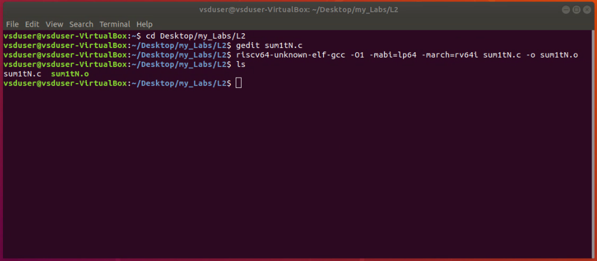

# Labs

Documention of the labs done in the workshop.

 

---
## Lab 1 
- Title: **c program to compute sum from 1 to N.**
- Objective: to use GCC (of host) and execute a simple c program.
- Steps:
    - The C code for sum of numbers from 1 to N
    - 
    - using the gcc command, the sum1tN.c is compiled and executed.
    - 

 

---
## Lab 2
- Title: **RISCV GCC compile and disassemble.**
- Objective: to use GCC (RISCV) for compiling and disassembling.
- Steps:
    - using the sum1tN.c file
    - 
    - the file sum1tN.c is passed to **riscv64-unkown-elf-gcc** with the flags: -march=rv64i, -mabi=lp64 and optimisation -O1
    - 
    - the file sum1tN.o is passed to the **riscv64-unkown-elf-objdump** with the flags: -d and | less
    - 
    - 
    - Note: the main starts from address 10184 and ends at 101B0, which gives B (11 in decimal) instructions inside the main function.

 

---
## Lab 3
- Title: **Spike Simulation and Debug**
- Objective: to simulate and debug a c program using spike
- Steps:
    - using the sum1tN.c file
    - 
    - pass the file to **riscv64-unkown-elf-gcc** with the flags: -march=rv64i, -mabi=lp64, optimisation -Ofast and -o sumitN_riscv
    - run the output (sumitN_riscv) using **spike pk**
    - 
    - Note: spike is the tool and pk flag indicates the riscv simulator, and -d flag in addition is used for debugging riscv.

 

---
## Lab 4