# Labs Day-1 and Day-2

Documention of the labs done in the RISCV MYTH workshop during Day-1 and Day-2. containing the tools *GCC RISCV* (cross compiler) and *SPIKE RISCV* (bare metal simulator simulator), and programming languages *C* and *ASM*.

- **Index**:
    - [Lab 1](#lab-1) C program to compute sum from 1 to N.
    - [Lab 2](#lab-2) RISC-V GCC cross compile and disassembling.
    - [Lab 3](#lab-3) Spike Simulation and Debugging.
    - [Lab 4](#lab-4) min and max values of Signed and Unsigned double words.
    - [Lab 5](#lab-5) Sum 1 to N using C and ASM (understanding ABI).
- Note: the images might take time to load. 

 

---
---
## Lab 1 
- Title: **C program to compute sum from 1 to N.**
- Objective: to use GCC (of host) and execute a simple c program.
- Steps:
    - The C code for sum of numbers from 1 to N
    - 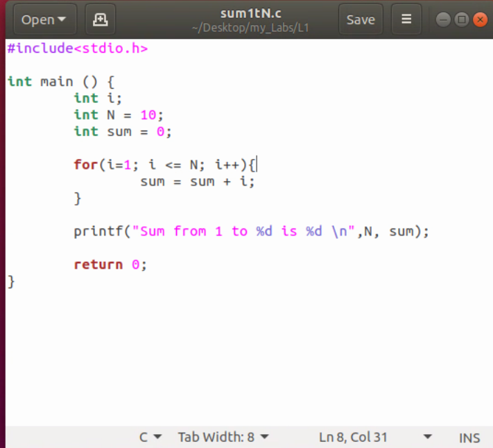
    - using the gcc command, the sum1tN.c is compiled and executed.
    - 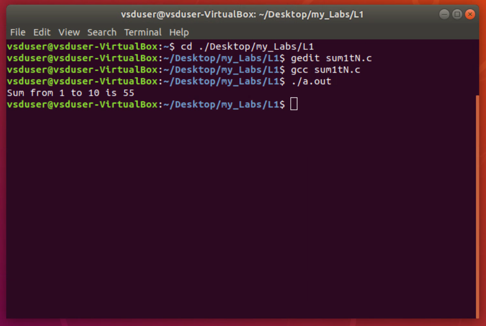

 

---
## Lab 2
- Title: **RISCV GCC compile and disassemble.**
- Objective: to use GCC (RISCV) for compiling and disassembling.
- Steps:
    - using the sum1tN.c file
    - 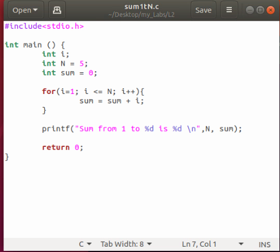
    - the file sum1tN.c is passed to **riscv64-unkown-elf-gcc** with the flags: -march=rv64i, -mabi=lp64 and optimisation -O1
    - 
    - the file sum1tN.o is passed to the **riscv64-unkown-elf-objdump** with the flags: -d and | less
    - 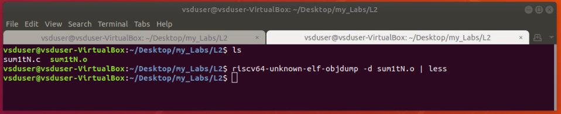
    - 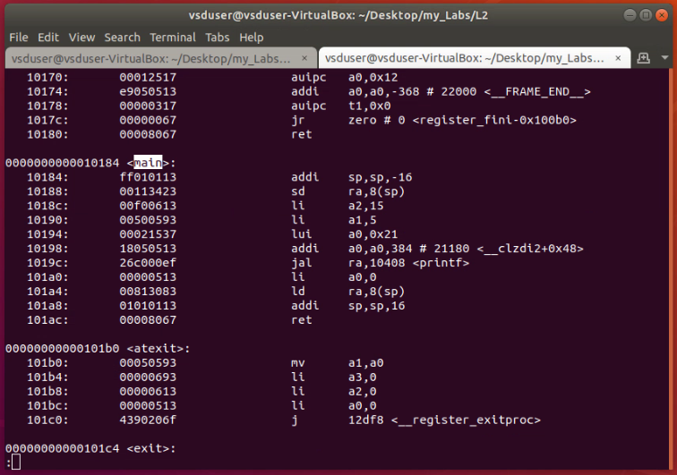
    - Note: the main starts from address 10184 and ends at 101B0, which gives B (11 in decimal) instructions inside the main function.

 

---
## Lab 3
- Title: **Spike Simulation and Debug**
- Objective: to simulate and debug a c program using spike.
- Steps:
    - using the sum1tN.c file
    - 
    - pass the file to **riscv64-unkown-elf-gcc** with the flags: -march=rv64i, -mabi=lp64, optimisation -Ofast and -o sumitN_riscv
    - run the output (sumitN_riscv) using **spike pk**
    - 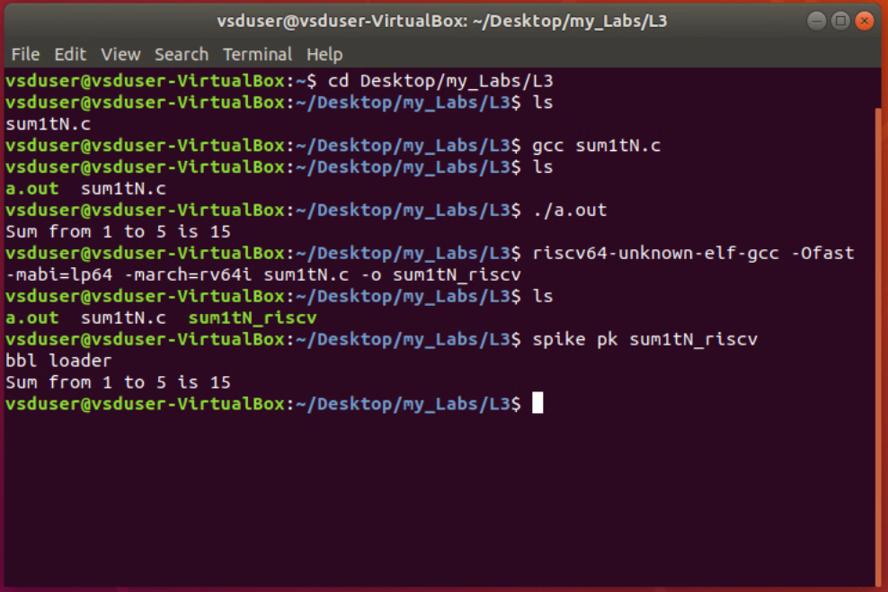
    - Note: spike is the tool and pk flag indicates the riscv simulator, and -d flag in addition is used for debugging riscv.

 

---
## Lab 4
- Title: **Signed and Unsigned Numbers**
- Objective: to simulate and find out the maximum and minimum values of signed and unsigned integer.
- Steps:
    - Note: the value to variables in the programs of signed and unsigned are given as 2 power (*bit_width* * 2), that is 2 power 128. And it is way beyond 64 bits can hold.
    - C code for finding min and max values for unsigned integer:
    - 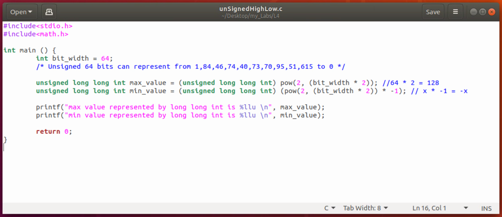
    - C code for finding min and max values for signed integer:
    - 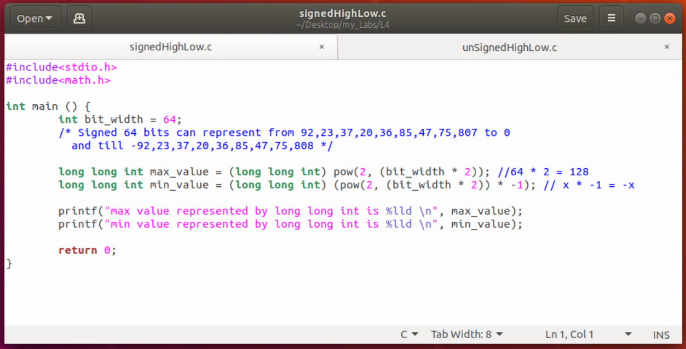
    - The outputs of simulating the above c codes using **spike tool** (with flag: pk) is:
    - 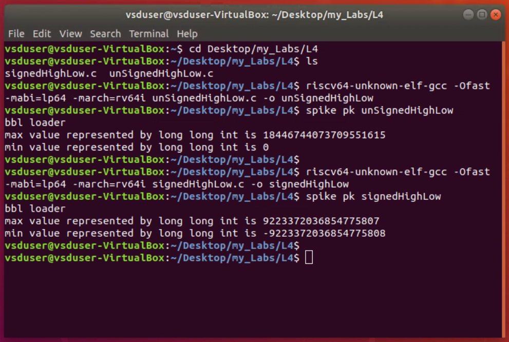

 

---
## Lab 5
- Title: **Sum 1 to N using ASM (understanding ABI)**
- Objective to call an asm function from C program and compute the result of sum from 1 to N.
- Steps:
    - C program calling an asm function (lable):
    - 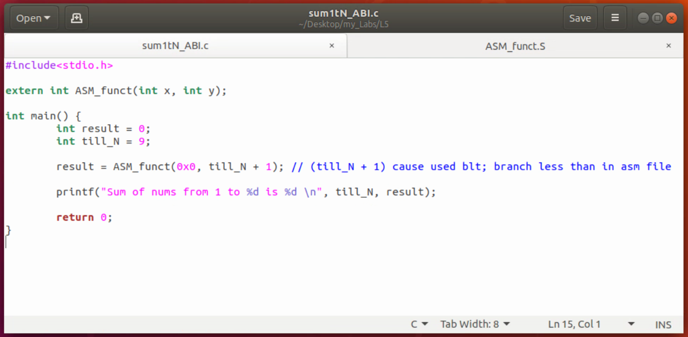
    - ASM program taking arguments and computing the sum from 1 to N:
    - 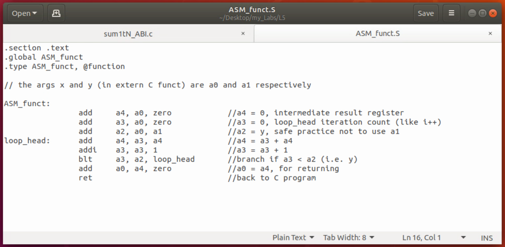
    - Compiled C and ASM programs (using GCC RISCV cross compiler), simulated (using spike pk). for 2 N values ( 9 and 15):
    - 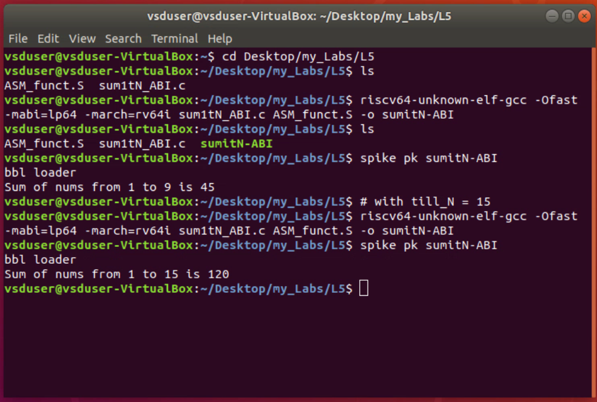
    - Output of Debugger (riscv64-unkown-elf-objdump with flag -d):
    - 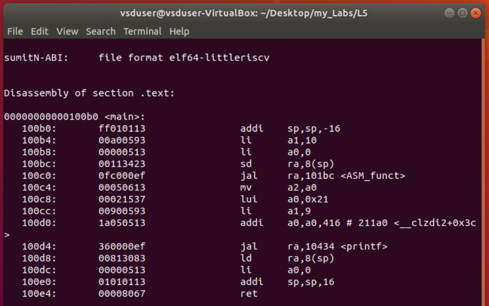
    - 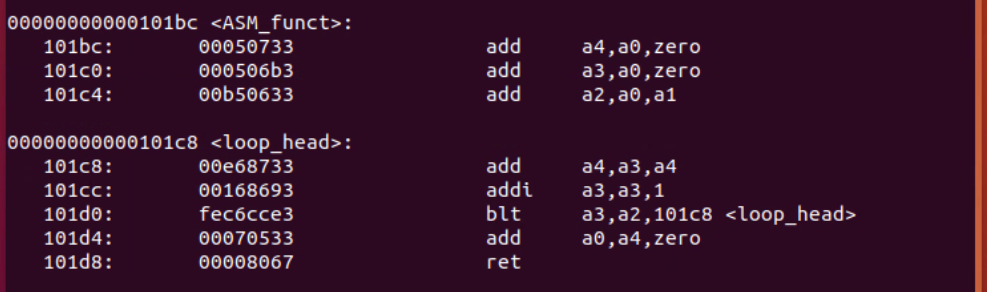

 

---
## Lab 6