# Labs of D3 module

Documention of the labs done in the RISCV MYTH workshop module D3.

- **Index:**
    - [Lab 1](#lab-1) Combinational circuits in TL-Verilog.
    - [Lab 2](#lab-2) Sequential circuits in TL-Verilog.
    - [lab 3](#lab-3) Pipeline circuits in TL-Verilog,
- Note: the images might take time to load. 

 

---
---
## Lab 1
- Title: **Lab on Combinational circuits**
- Objective: use makerchip online IDE to perform the stated tasks.
- Tasks in total: 0 to 4 (5).

 

- **Task 0:**
    - **Objective:** To *Navigate, Setup and Recreate* the screen in makerchip online IDE.
    - Note: the lab is to focus on the error ports, and check that makerchip online IDE auto highlites all occurances everywhere.
    - 

- **Task 1:**
    - **Objective:** To write the TL-verilog code for *Logic Gates*.
    - Note: the alert/warning logo beside the Log is due to not assigning few variables, it is not an issue since the makerchip online IDE identifies creates an random stymulus.
    - 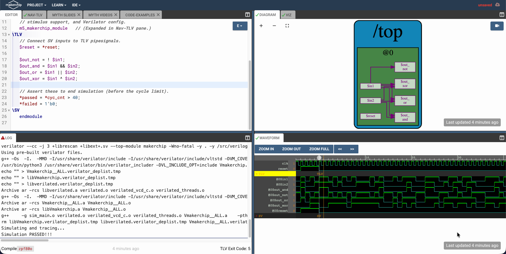

- **Task 2:**
    - **Objective:** To write the TL-verilog code for *Vectored inputs* and *arithematic addition operator*.
    - Note: the alert/warning logo beside the Log is due to not assigning few variables, it is not an issue since the makerchip online IDE identifies creates an random stymulus.
    - 

- **Task 3:**
    - **Objective:** To write the TL-verilog code for *Multiplexer*.
    - **Details:** inputs are of 8 bit width and 2X1 Mux.
    - Note: the alert/warning logo beside the Log is due to not assigning few variables, it is not an issue since the makerchip online IDE identifies creates an random stymulus.
    - 

- **Task 4:**
    - **Objective:** To write the TL-verilog code for *Combinational Calculator*.
    - **Details:** inputs are of 32 bitwidth, opration_select is 4 bitwidth and include internal nodes like sum, diff, prod and quot.
    - Note: the alert/warning logo beside the Log is due to not assigning few variables, it is not an issue since the makerchip online IDE identifies creates an random stymulus.
    - 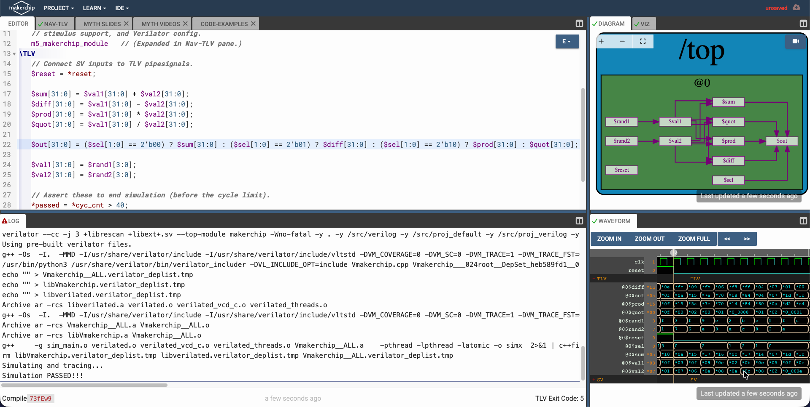

 

---
## Lab 2
- Title: **Lab on Sequential circuits**
- Objective: use makerchip online IDE to perform the stated tasks.
- Tasks in total: 0 to 2 (3).

 

- **Task 0:**
    - **Objective:** To write the TL-Verilog code for counter.
    - **Details:** increament the out by 1 every clock cycle.
    - Note: the alert/warning logo beside the Log is due to not assigning few variables, it is not an issue since the makerchip online IDE identifies creates an random stymulus.
    - 

- **Task 1:**
    - **Objective:** To write the TL-Verilog code for fibonacci series.
    - **Details:** add previous and previous-previous results, output 1 when reset is active.
    - Note: the alert/warning logo beside the Log is due to not assigning few variables, it is not an issue since the makerchip online IDE identifies creates an random stymulus.
    - 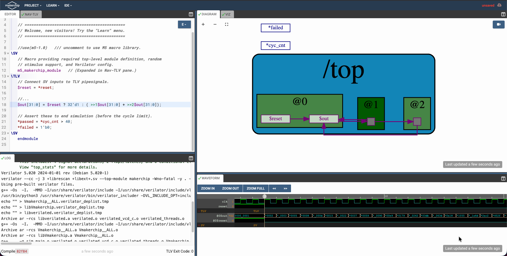

- **Task 2:**
    - **Objective:** To write the TL-Verilog code for calculator (with feedback).
    - **Details:** feed the output to the input through val1.
    - Note: the alert/warning logo beside the Log is due to not assigning few variables, it is not an issue since the makerchip online IDE identifies creates an random stymulus.
    - 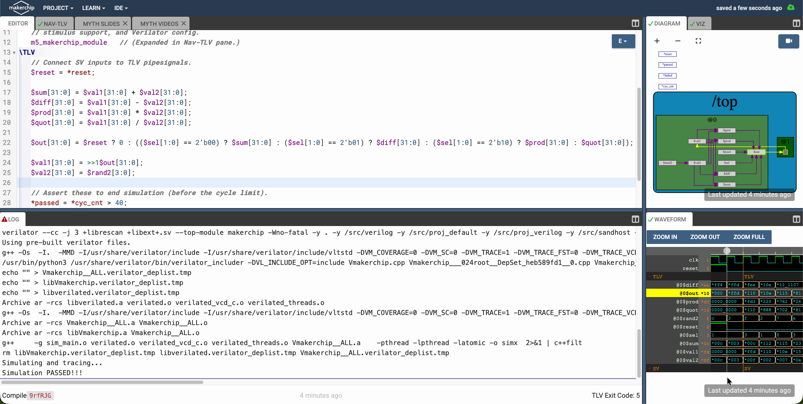

 

---
## Lab 3
- Title: **Lab on Sequential circuits (Pipelined Logic)**
- Objective: use makerchip online IDE to perform the stated tasks.
- Tasks in total: 0 to 4 (5).

 

- **Task 0:**
    - **Objective:** To write the TL-Verilog code for error identifier pipeline.
    - **Details:** 6 stage pipeline for identifying error.
    - Note: the alert/warning logo beside the Log is due to not assigning few variables, it is not an issue since the makerchip online IDE identifies creates an random stymulus.
    - 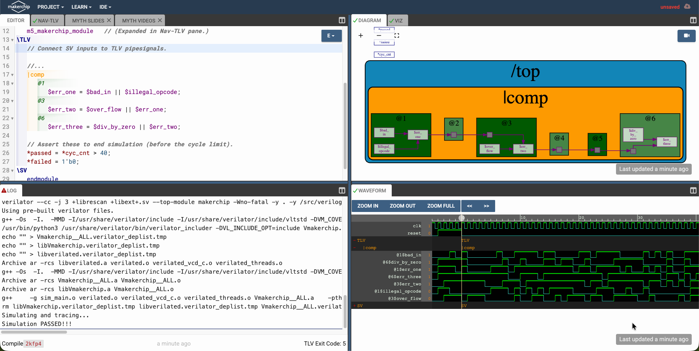

- **Task 1:**
    - **Objective:** To write the TL-Verilog code for Calculator with counter.
    - **Details:** 32bit-width calculator and count value.
    - Note: the alert/warning logo beside the Log is due to not assigning few variables, it is not an issue since the makerchip online IDE identifies creates an random stymulus.
    - 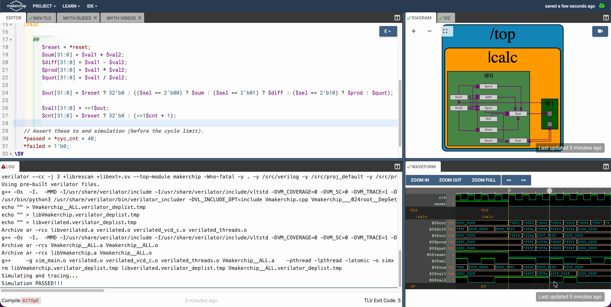

- **Task 2:**
    - **Objective:** To write the TL-Verilog code for Calculator with even odd cycle oscillator.
    - **Details:** valid changes every cycle. high for odd cycle and low for even cycle.
    - Note: the alert/warning logo beside the Log is due to not assigning few variables, it is not an issue since the makerchip online IDE identifies creates an random stymulus.
    - 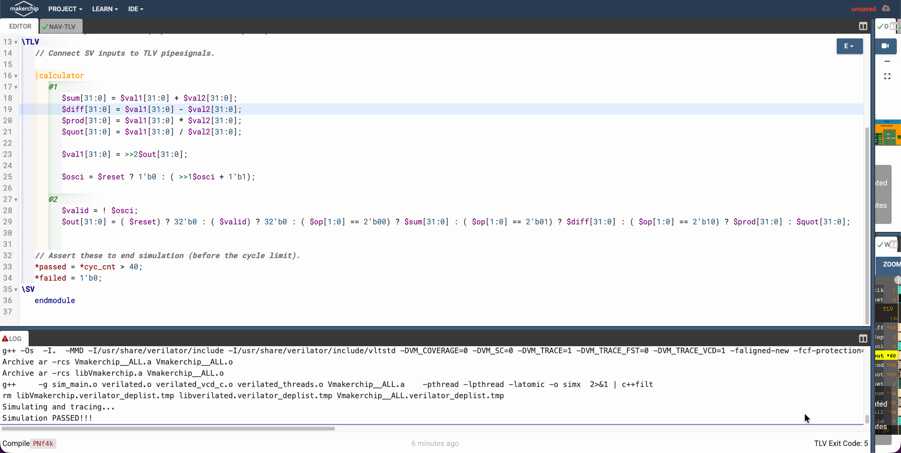
    - 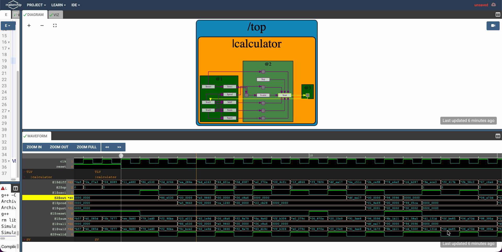

- **Task 3:**
    - **Objective:** To write the TL-Verilog code for Calculator with valid.
    - **Details:** output 0 for every odd cycle.
    - Note: the alert/warning logo beside the Log is due to not assigning few variables, it is not an issue since the makerchip online IDE identifies creates an random stymulus.
    - 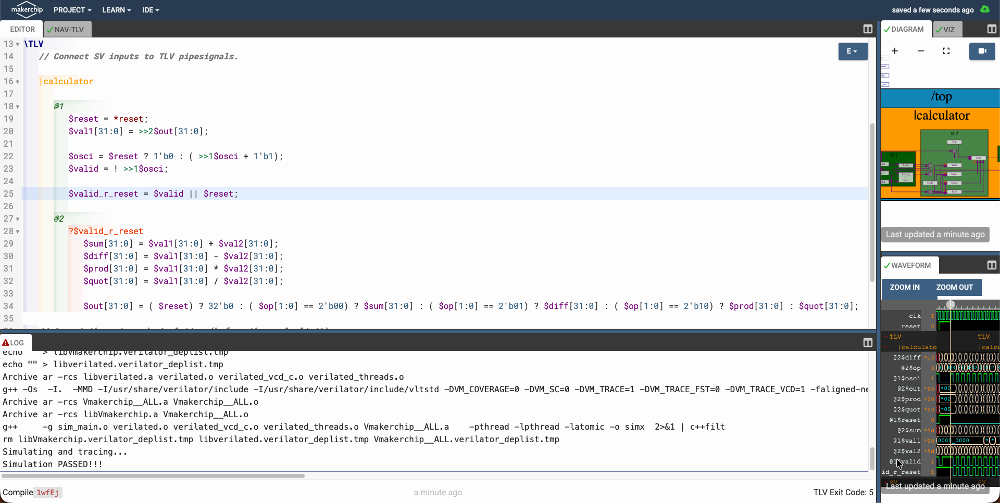
    - 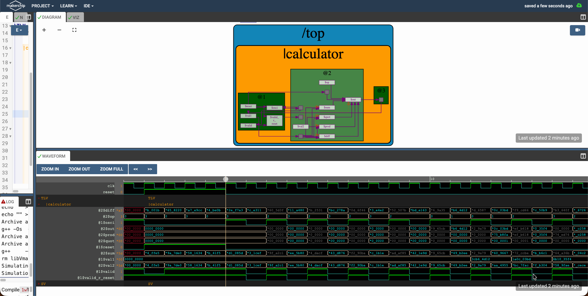

- **Task 4:**
    - **Objective:** To write the TL-Verilog code for Calculator with memory.
    - **Details:** recall with $op is 3'b101 and new value when $op[2] is high.
    - Note: the alert/warning logo beside the Log is due to not assigning few variables, it is not an issue since the makerchip online IDE identifies creates an random stymulus.
    - 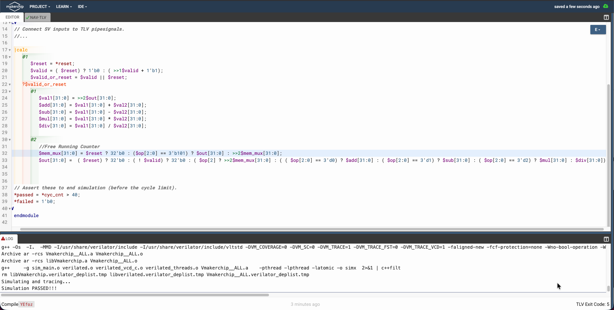
    - 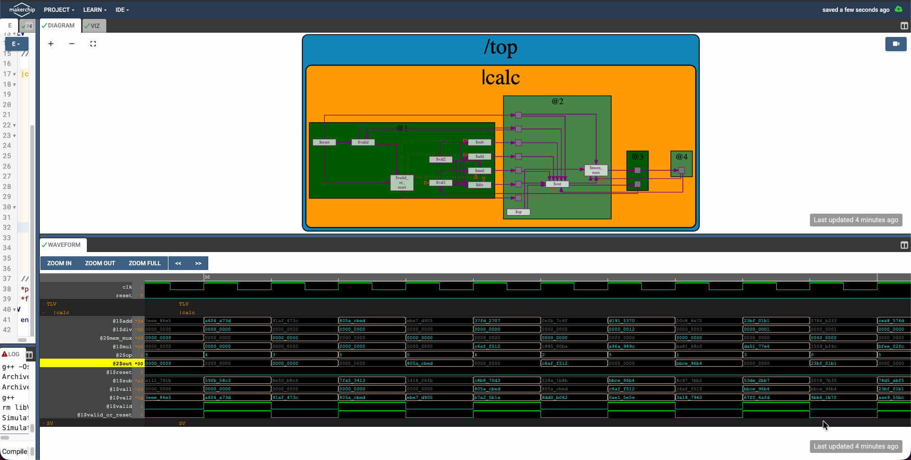

 

---
## Lab 4
